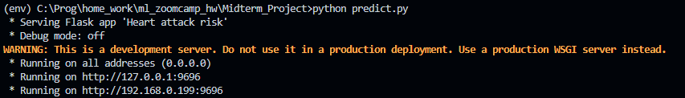
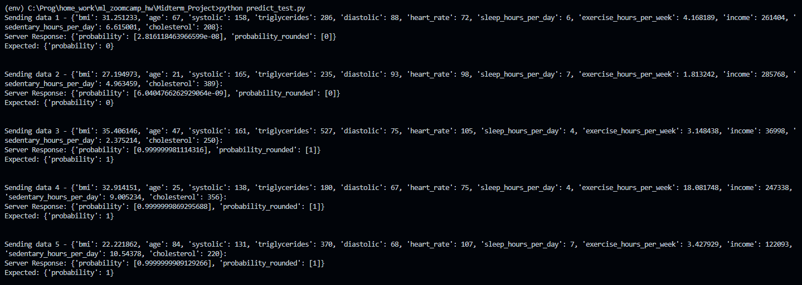
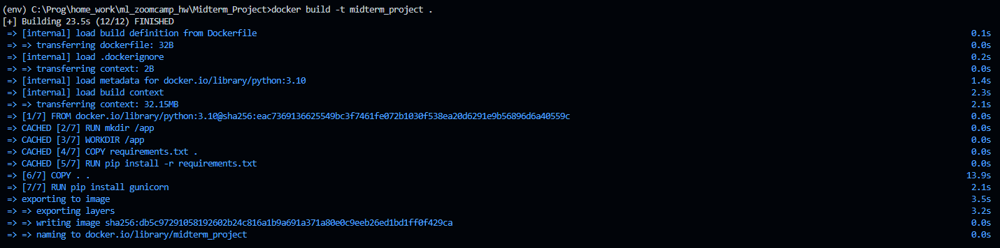
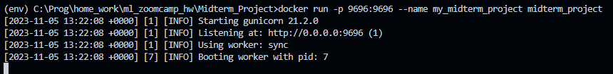
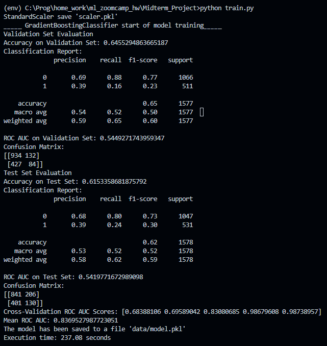

# Heart attack risk predict  

## Problem Description  

### The data is taken from [Heart Attack Risk Prediction Dataset](https://www.kaggle.com/datasets/iamsouravbanerjee/heart-attack-prediction-dataset/data)  

The heart attack risk prediction model developed from this large dataset is a major advance in cardiovascular health. Using a combination of demographic, lifestyle, and health characteristics, this predictive model predicts the likelihood of a heart attack, providing researchers and healthcare providers with a tool for a proactive strategy.  

Using predictive analytics and machine learning techniques, this model accounts for the complex interdependencies between multiple factors including age, cholesterol levels, blood pressure, smoking habits, physical activity, dietary preferences, and more. This broad feature set provides a robust framework for understanding the complex dynamics contributing to heart attacks.  

The use of this model not only assists in risk stratification, but also lays the foundation for health promotion, optimisation of health care resources and a proactive approach to cardiovascular health. This demonstrates a collaborative effort to expand our understanding of cardiovascular well-being and is a step towards a healthy future by reducing the burden of cardiovascular disease through informed decision-making and proactive health management.

### Installing and running the project

#### Running on a local machine
1. Clone the repository:
```
git clone https://github.com/Sharpylo/ml_zoomcamp.git
```
2. Navigate to the project directory:
```
cd Midterm_Project
```
3. Activate the virtual environment:
```
env\Scripts\activate
```
4. Install necessary dependencies:
```
pip install -r requirements.txt
```

### Usage
#### Running the Project
- To run the project, execute the following commands:
```
python predict.py
```
Expected Result:

- For running the test suite:
```
python predict_test.py
```
Expected Result:



### Building and Running Docker Container
- Build the Docker image:
Run the following command in the terminal where the Dockerfile is located:
```
docker build -t midterm_project .
```
Expected Result:

- Run the Docker container:
Run the container and map the port:
```
docker run -p 9696:9696 --name my_midterm_project midterm_project
```
Expected Result:

- For running the test suite:
```
python predict_test.py
```
Expected Result:


### Observation: If you want to train a model

Make your changes in train.py and run the file using the command below.
```
python train.py
```
Expected Result:

