# Plants Classification  

## Problem Description  

### The data is taken from [Plants Classification](https://www.kaggle.com/datasets/marquis03/plants-classification)  

The dataset contains **30 types** of plants images, including **21000 training** images, **3000 validation** images and **6000 test** images, with a total data size of **1.48GB**, and supports the recognition of the following plants types: **aloevera**, **banana**, **bilimbi**, **cantaloupe**, **cassava**, **coconut**, **corn**, **cucumber**, **curcuma**, **eggplant**, **galangal**, **ginger**, **guava**, **kale**, **longbeans**, **mango**, **melon**, **orange**, **paddy**, **papaya**, **peperchili**, **pineapple**, **pomelo**, **shallot**, **soybeans**, **spinach**, **sweetpotatoes**, **tobacco**, **waterapple**, and **watermelon**.

1. **Consistent Dataset Sizes:**
   * Each class in every dataset (Train, Validation, and Test) contains 700 images. This suggests a consistent and balanced distribution of images across different plant classes
2. **Uniformity Across Datasets:**
   * The counts are the same for each class in all three datasets (Train, Validation, and Test). This uniformity is essential for ensuring that the model is trained on a diverse and representative set of data, and its performance can be reliably evaluated on the validation and test sets.
3. **Adequate Validation and Test Sets:**
   * The validation and test sets both have 100 images per class, providing a substantial amount of data for model evaluation. This ensures that the model is assessed on a diverse set of examples, enhancing its generalization to new, unseen data.
4. **Potential Overfitting Considerations:**
   * While the dataset appears balanced and well-distributed, it's essential to monitor the model's performance to check for overfitting. If the model performs significantly better on the training set compared to the validation and test sets, it may indicate overfitting.
5. **Model Training Considerations:**
   * The balanced distribution of images across classes in the training set is beneficial for training a model that learns to recognize various plant classes effectively. The model should be able to generalize well to unseen data if the training set is representative of the overall distribution.

### EDA and Model Description

The results of EDA and model fitting can be observed in the file  
**plants_classification .ipynb**

The following conclusions can be drawn from the estimation results of multiple models of models (Keras Tuner):  

1. Model 1 - **CNN**:  
    - Best Parameters: {'conv1_units': 64, 'conv2_units': 64, 'conv3_units': 640, 'dense_units': 896, 'l2_reg': 0.0001145, 'dropout_rate': 0.3, 'learning_rate': 0.001}  
    - Accuracy on the test kit: 63%  
    - Loss on the test kit: 1.5097  
    Expected Result:  
    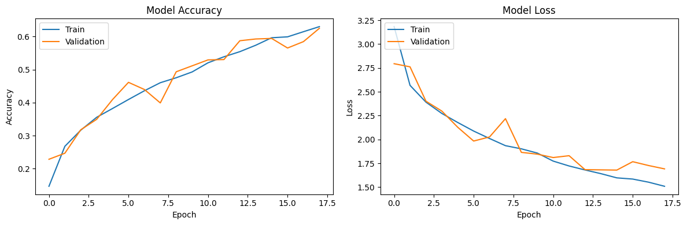
    Results after prediction, in red not correctly predicted, in green correctly predicted:  
    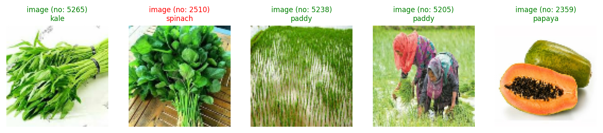
    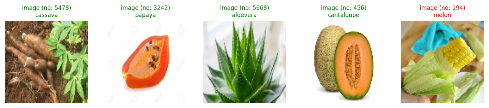
    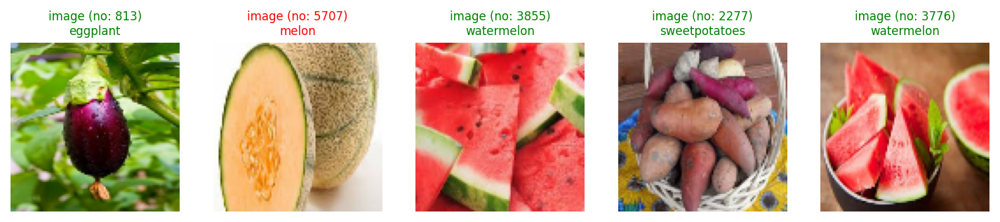
    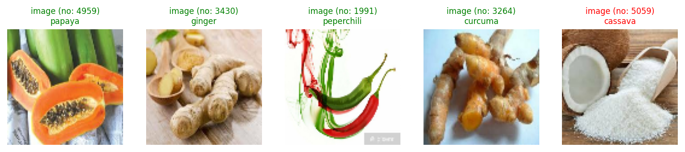
    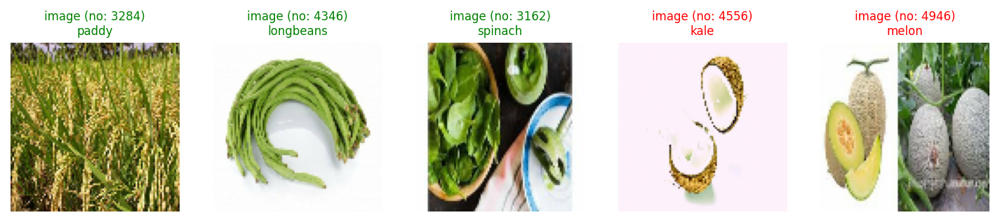

2. Model 2 - **MobileNetV2**:   
    - Best Parameters: {'units_1': 3456, 'dropout_1': 0.4, 'learning_rate': 0.0005}  
    - Accuracy on the test kit: 86.96%  
    - Loss on the test kit: 0.8006  
    Expected Result:    
    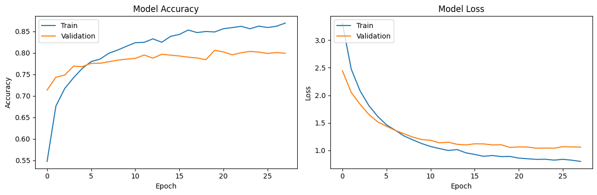
    Results after prediction, in red not correctly predicted, in green correctly predicted:  
    
    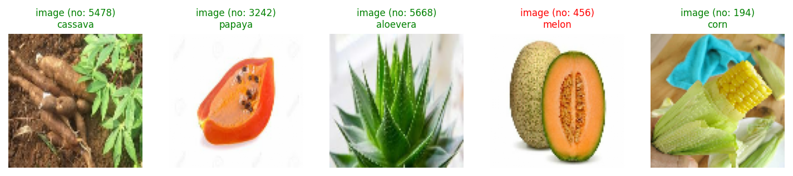
    
    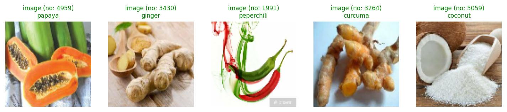
    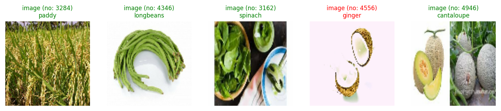

**Conclusion model 1:**  

**Model Performance:**  
    The model achieved a reasonable accuracy on both the training and validation sets, demonstrating its ability to learn from the given data.  
**Overfitting Consideration:**  
    The early stopping mechanism helped prevent potential overfitting, as indicated by the divergence between training and validation metrics.  
**Class-wise Performance:**  
    The classification report provides details on the model's performance on individual classes. Some classes may exhibit higher accuracy, while others might pose more challenges.  

In summary, while the model exhibits promising learning capabilities, further refinement and exploration of hyperparameters may be beneficial to achieve even better performance. Additionally, thorough evaluation on a test set is crucial for a comprehensive assessment of the model's generalization abilities.  

**Conclusion model 2:**  

**Training Progress:**   
    - The training accuracy increases steadily from 54.90% in the first epoch to 86.43% in the last epoch.  
The training loss decreases from 3.2850 to 0.8098 over the epochs  
**Validation Progress:**  
    - The validation accuracy improves from 69.97% to 81.20%.  
    - The validation loss decreases from 2.4581 to 1.0456.  
**Test Performance:**  
    - The model achieves a test accuracy of 79.97%.  
    - The classification report provides detailed information about precision, recall, and F1-score for each class.  
**Conclusion:**  
    - The model shows good generalization to the validation and test sets, with an acceptable level of accuracy.  
    - The early stopping mechanism is triggered at epoch 26, indicating that the model did not improve significantly on the validation set after epoch 23.  
    - The model exhibits some variation in class-wise performance, with precision, recall, and F1-score varying across different classes.  

**Conclusion in general**  

Both models showed some problems in training and testing. *Model 1* may suffer from insufficient complexity or insufficient data for training. *Model 2*, using the pre-trained MobileNetV2, performed better, but may need further tuning or data augmentation to improve its generalisation ability.  


### Installing and running the project

#### Running on a local machine
1. Clone the repository:
```
git clone https://github.com/Sharpylo/ml_zoomcamp.git
``` 
2. Navigate to the project directory:
```
cd capstone_1
```
3. Create a folder **data_plants**:
```
mkdir data_plants
```
4. Download the data and unzip it into the **data_plants** folder      
Download data from Kaggle datasets - [Plants Classification](https://www.kaggle.com/datasets/marquis03/plants-classification). Archive size 1.37 Gb  

    Expected Result:  
    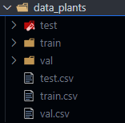  
5. Create a virtual environment named "env":
```
python -m venv env
```
6. Activate the virtual environment:
```
env\Scripts\activate
```
7. Install necessary dependencies:
```
pip install -r requirements.txt
```

### Usage
#### Running the Project
- To run the project, execute the following commands:
```
python predict.py
```
Expected Result:   
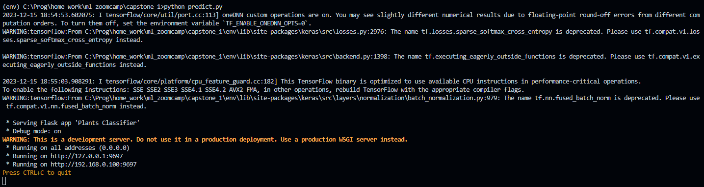
- To run the test package on the previously prepared image:
```
python predict_test.py
```

We will send this picture for prediction:  


Expected Result:  
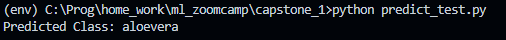

- To run the test suite and prediction by URL:  
```
python predict_on_url.py
```

Expected Result:  

https://github.com/Sharpylo/ml_zoomcamp/assets/109329799/ab717745-80bb-42e7-b5b6-fed2f090b1a1

### Building and Running Docker Container
- Build the Docker image:
Run the following command in the terminal where the Dockerfile is located:
```
docker build -t capstone_1 .
```
Expected Result:  
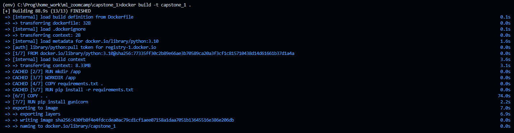
- Run the Docker container:
Run the container and map the port:
```
docker run -p 9697:9697 --name my_capstone_1 capstone_1
```
Expected Result:  
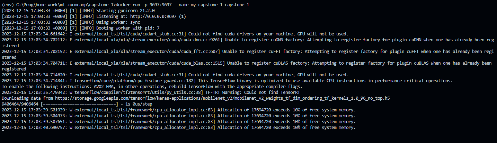
- To run the test package on the previously prepared image:
```
python predict_test.py
```

We will send this picture for prediction:
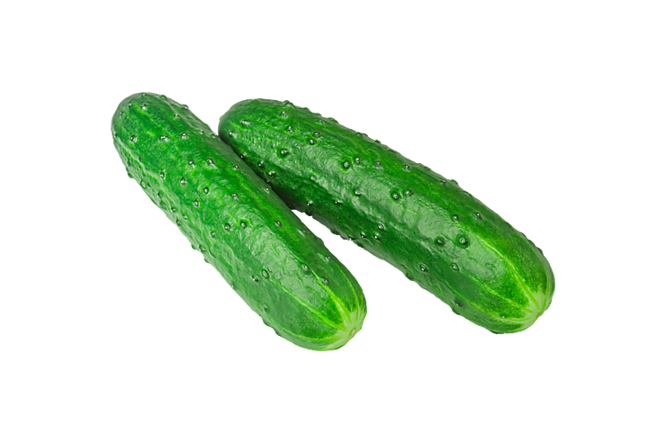

Expected Result:  
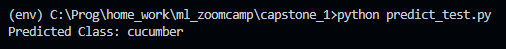  


### Observation: If you want to train a model

Make your changes in train.py and run the file using the command below.
```
python train.py
```
Expected Result:  

https://github.com/Sharpylo/ml_zoomcamp/assets/109329799/531486bc-db29-4bf5-bac2-7df464099aaa


### Demonstration of work:

https://github.com/Sharpylo/ml_zoomcamp/assets/109329799/8a6756a4-8bc3-4610-9922-99a4bd09cd6a